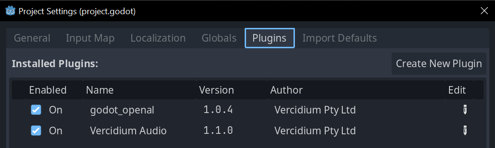
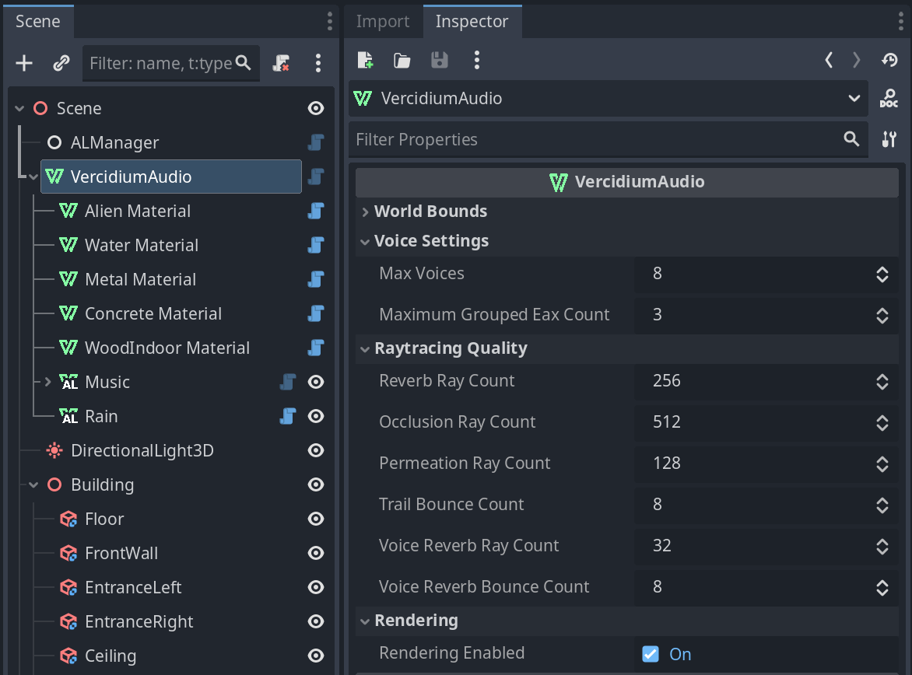
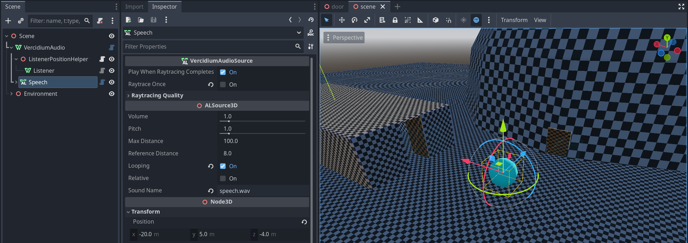
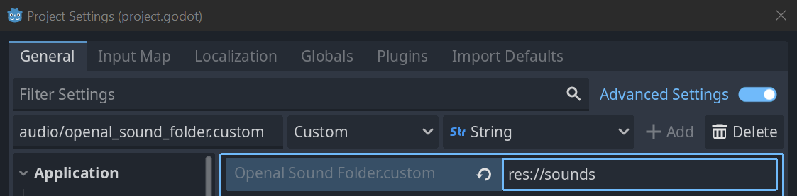
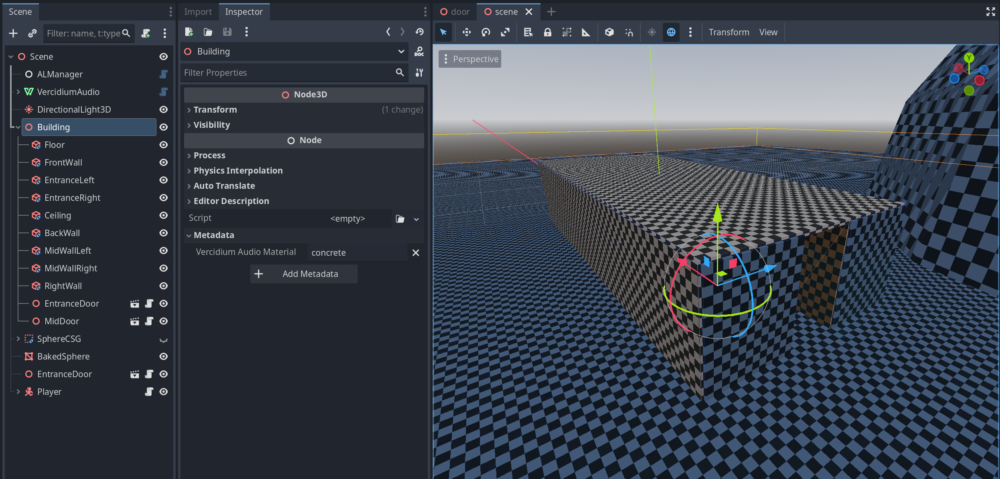
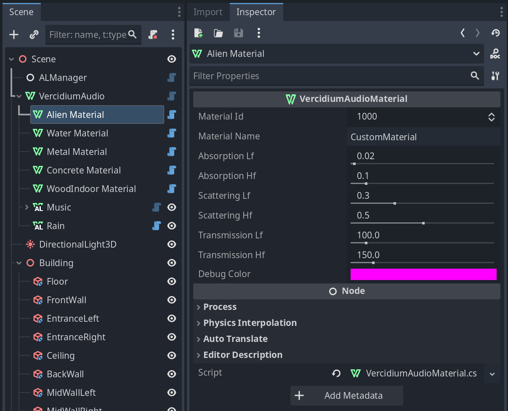

## Godot Raytraced Audio

References:
- [godot_openal repo](https://github.com/vercidium-patreon/godot_openal)
- [C# SDK documentation](https://docs.vercidium.com/raytraced-audio/Getting+Started)

### Step 1 - Enable Plugins
In Project > Project Settings > Plugins:
1. Enable "OpenAL Audio"
2. Enable "Vercidium Audio"

### Step 2 - Add Main Nodes
In your main scene, add an `ALManager` node and a `VercidiumAudio` node:

The `ALManager` node overrides Godot's inbuilt audio system, and has settings for controlling volume, output/input device, etc. Read more on the [godot_openal](https://github.com/vercidium-patreon/godot_openal) repository. 

You can also customise the number of rays on the `VercidiumAudio` node, set the raytraced world size, and enable the debug rendering window that appears when running your game.

## Sound Playback

To play a 3D sound with raytracing automatically applied, create a new `VercidiumAudioSource` node in your scene.

Set its `Sound Name` to the path of the sound in the `res://audio` folder, and set `Play When Raytracing Completes` to play the sound automatically when it is raytraced.

If your sound files live in a different folder, you can set a custom path using the `audio/openal_sound_folder.custom` setting:

## Primitives

For a 3D object to affect raytracing, it must have a `vercidium_audio_material` string metadata field.

Materials also apply to child nodes. In the screenshot below, I've set a `concrete` material on the `Building` node, which sets the material of every child node to `concrete`. To exclude a child node from raytracing, set its material to `air`.

## Custom Materials

To create a new material, add a `VercidiumAudioMaterial` child node to the VercidiumAudio node:

See the [default material properties](https://docs.vercidium.com/raytraced-audio/Materials#Default+Material+Properties) for reference values.

You can also edit the default materials by setting the `Material Name` to the same name as a [default material](https://docs.vercidium.com/raytraced-audio/Enums/MaterialType). The material name must be all lowercase, e.g. 'concrete', 'woodindoor', 'metal'.