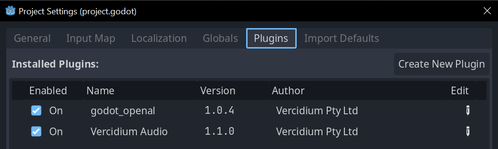
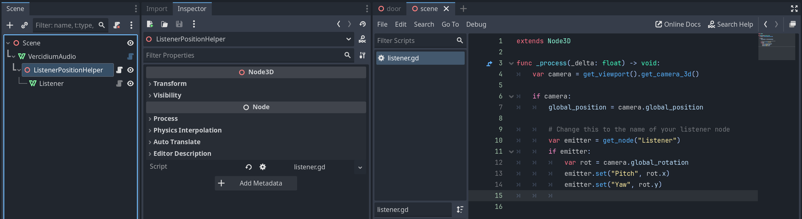
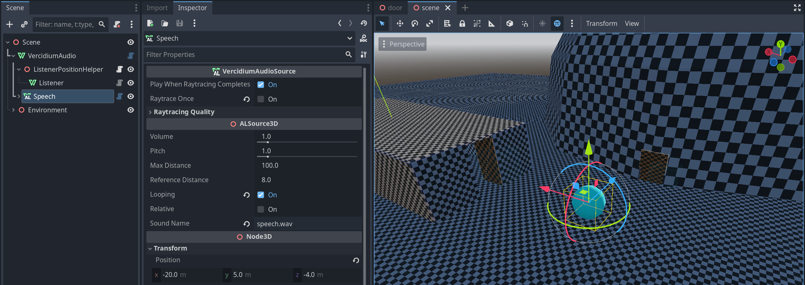
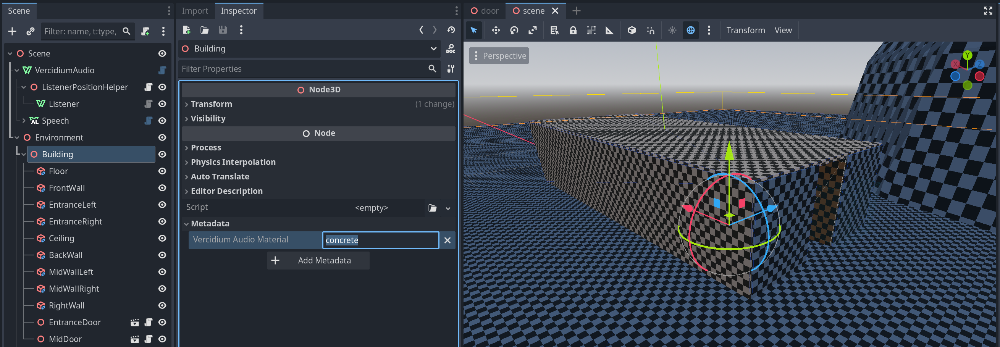
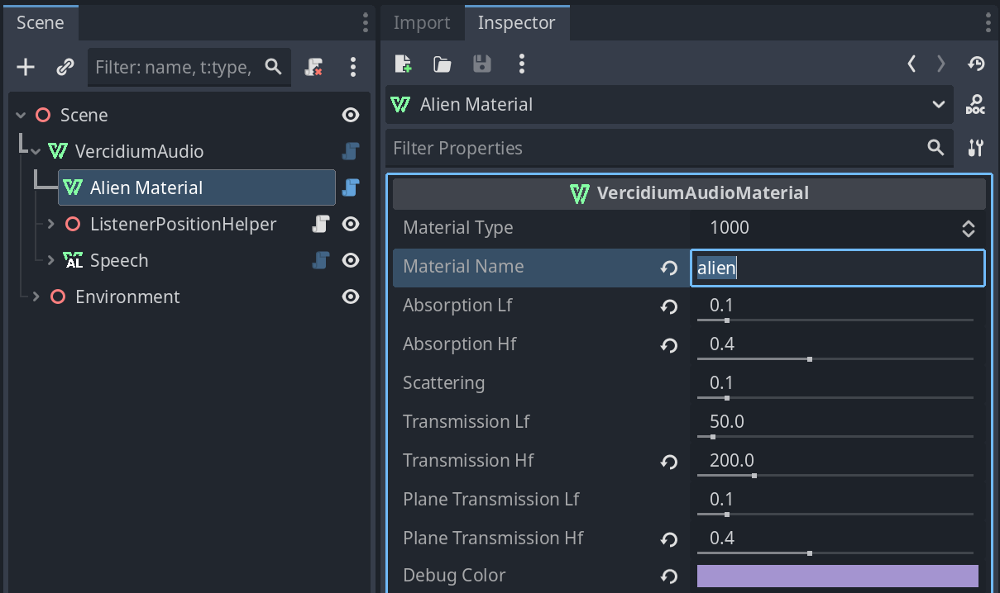

## Godot Raytraced Audio

References:
- [godot_openal repo](https://github.com/vercidium-patreon/godot_openal)
- [C# SDK documentation](https://docs.vercidium.com/raytraced-audio/v110/Getting+Started)

### Step 1 - Enable Plugins
Copy the `godot_openal` and `godot_raytraced_audio` folders to the `addons` folder in your project:


Open Godot and click `Project > Project Settings > Plugins`:
1. Enable "OpenAL Audio"
2. Enable "Vercidium Audio"



### Step 2 - Add Main Nodes
In your main scene, add a `VercidiumAudio` node:


The `VercidiumAudio` node has a few settings that you can customise. For now I recommend enabling `Rendering Enabled` and leaving the other settings as is:


> The ALManager node is added automatically as an autoload. Read more on the [godot_openal](https://github.com/vercidium-patreon/godot_openal) repository. 

## Listener

Create a `VercidiumAudioEmitter` node within your `VercidiumAudio` node, and set:
- `Is Main Listener` to true
- `Raytrace Once` to false
- `Affects Grouped EAX` to false
- `Has Reverb Pan` to true


There can only be one main listener. This emitter will cast reverb, occlusion, permeation and ambient permeation rays. You can adjust the number of rays in the `Raytracing Quality` section below `Has Reverb Pan`.

This emitter is a Node3D, and you can adjust its position to control where rays originate from. In my demos, I wrap the listener in another Node3D, which has a script to align the listener emitter with the camera:

```py
extends Node3D

func _process(_delta: float) -> void:
	var camera = get_viewport().get_camera_3d()

	if camera:
		global_position = camera.global_position

        # Change this to the name of your listener node
		var emitter = get_node("Listener")
		if emitter:
			var rot = camera.global_rotation
			emitter.set("Pitch", rot.x)
			emitter.set("Yaw", rot.y)
```

The full setup now looks like this:



## Sound Playback

To play a 3D sound with raytracing automatically applied, create a new `VercidiumAudioSource` node in your scene.



Set its `Sound Name` to the path of your sound in the `res://audio` folder, and set `Play When Raytracing Completes` to play the sound automatically when it is raytraced.

For short sounds I recommend setting `Raytrace Once` to true, as it's enough to just raytrace the source once to figure out how muffled it is. For longer continuous sounds like music or speech, set `Raytrace Once` to false to ensure they are automatically muffled/clear as the environment changes.

If your sound files live in a different folder, you can set a custom path using the `audio/openal_sound_folder.custom` setting:


## Primitives

For a 3D object to affect raytracing, it must have a `vercidium_audio_material` string metadata field. 

Materials also apply to child nodes. In the screenshot below, I've set a `concrete` material on the `Building` node, which sets the material of every child node to `concrete`. To exclude a child node from raytracing, set its material to `air`.



> To ensure your scene is set up correctly, set `Rendering Enabled` to true on your `VercidiumAudio` node. This will display a debug window that shows all primitives with materials.

## Custom Materials

To create a new material, add a `VercidiumAudioMaterial` child node to the VercidiumAudio node:



Set `Material Name` to a custom string, e.g. `'alien'`, and then set the `vercidium_audio_material` metadata field to `alien` on a 3D primitive.

See the [default material properties](https://docs.vercidium.com/raytraced-audio/v110/Materials#Default+Material+Properties) for reference values.

You can also edit the default materials by setting the `Material Name` to the same name as a [default material](https://docs.vercidium.com/raytraced-audio/v110/Enums/MaterialType). The material name must be all lowercase, e.g. 'concrete', 'woodindoor', 'metal'.