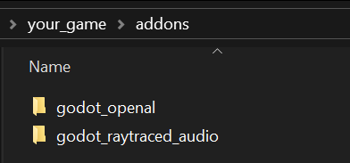
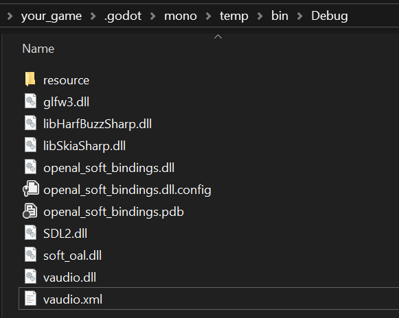
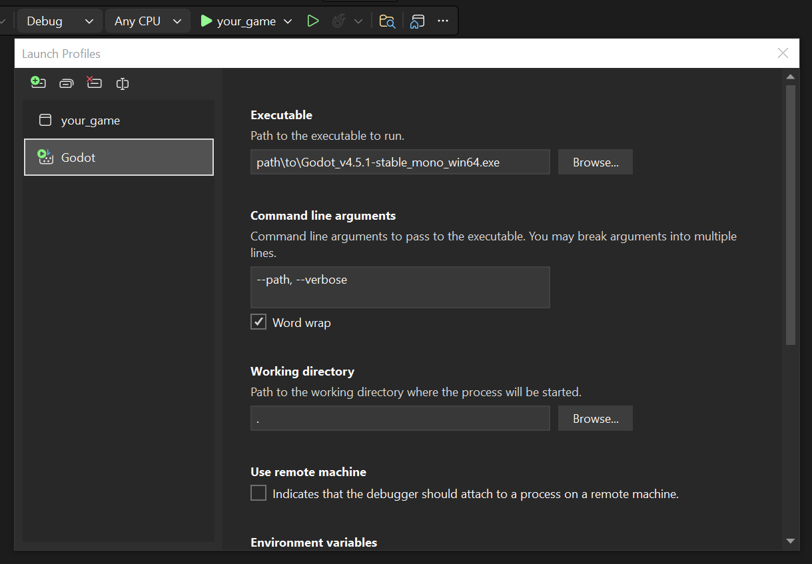

# Vercidium Audio

Raytraced audio system with realistic occlusion and reverb for Godot 4.

## Features

- Muffle sounds in real time
- Accurate reverb in any environment
- Innovative event-based raytracing system
- Realistic energy-based model using materials
- Dynamic scene updates - automatically handles moving objects

## Requirements

- **OpenAL Audio plugin** - This plugin (currently) depends on the [godot_openal](https://github.com/vercidium-patreon/godot_openal) plugin and must be enabled first
- Godot 4.x with C# support
- Vercidium Audio SDK

## Installation

1. Copy the entire `godot_raytraced_audio` folder to your project's `addons/` directory.

2. Copy `vaudio.dll` and its dependencies to the `your_game\.godot\mono\temp\bin\Debug` output folder. To copy these files automatically, see the [csproj example here](https://docs.vercidium.com/raytraced-audio/Project+Setup+and+Troubleshooting).

3. Continue reading in [project setup](./PROJECT_SETUP.md).

## Visual Studio

To run your Godot project from Visual Studio, click the small dropdown arrow next to `your_game` and click `your_game Debug Properties`.

Create a new launch profile by clicking the green icon in the top left, and rename it to `Godot`. Then set:
- the executable path
- command line parameters
- the working directory to `.`

Then close the window, click the same small dropdown arrow, and select `Godot`. Use this launch profile from now on.

## Requirements

This plugin requires a license for the Vercidium Audio C# SDK. [Apply here](https://vercidium.com/audio) to get early access.

## To-do

- Support all Godot primitives (capsule, cylinder, etc)